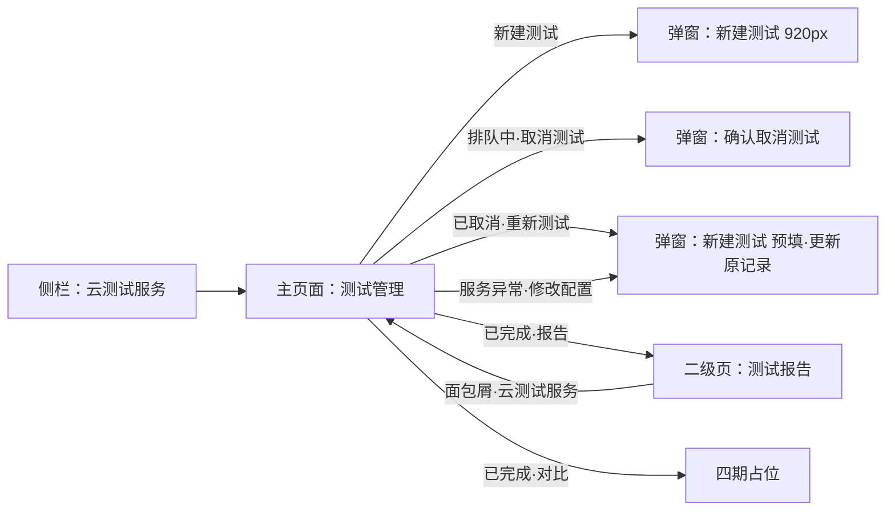

# prd_云测试服务_02.md

## 最简单信息摘要（极简版）

- **需求目标**：在一期主页面基础上，补齐测试管理核心闭环——新建/取消/重新测试/修改配置，并新增独立测试报告二级页。
- **页面数**：**2 页**（迭代 `云测试服务.html` + 新增 `云测试服务-测试报告.html`）。
- **核心入口与跳转**：侧栏进入主页面；「报告」→ 报告二级页（面包屑可返回）；「对比」四期再做（本期占位）。
- **模版组合**：`LayoutSpec` + `InfoQuery`（主页面）+ `Modal`（920px 新建/确认）+ `LayoutSpec` + Line Tab + `Dashboard`/`InfoQuery`（报告页）。
- **数据策略**：全量 mock；模式管理 Tab 维持一期不变。
- **四期预留**：对比弹窗、查看截图 + 日志。
- **待确认项**：无阻塞项。

---

## 0. 一句话描述

在云测试服务主页面（一期）基础上，迭代测试管理能力：支持新建/取消/重新测试/修改配置弹窗交互，并新增独立测试报告二级页，帮助开发者完成测试发起、任务变更与结果查看闭环。

---

## 1. 信息架构

### 1.0 目录树对照

| # | 页面 | 判定 | 归属 group → leaf | 现有文件 |
|---|------|------|-------------------|----------|
| 1 | 云测试服务（主页面） | **迭代** | Development → Cloud Testing Service | `webpage/云测试服务.html` |
| 2 | 云测试服务-测试报告 | **新页面**（同 leaf 下二级页） | Development → Cloud Testing Service | 本期新增 `webpage/云测试服务-测试报告.html` |

- **不新增** group / leaf。
- **模式管理 Tab**：维持一期实现，本期不改（三阶段需求单独推进）。

### 1.1 功能属性

| 项 | 内容 |
|----|------|
| 功能类型 | 既有 leaf 迭代 + 同能力下新增二级页 |
| 迭代说明 | 在一期主页面增加弹窗交互；新增报告独立 HTML；模式管理不变 |
| 目标用户 | 开发者 / 测试人员 |

### 1.2 导航与入口

| 项 | 内容 |
|----|------|
| 顶栏归属 | 沿用控制台壳层，顶栏不设选中态 |
| 侧栏路径 | **开发 > 云测试服务** |
| 默认选中项 | **云测试服务** |

---

## 2. 页面数量与跳转关系

### 2.1 页面清单

| # | 页面名称 | 文件名/路由（建议） | 入口 | 跳转至 |
|---|----------|---------------------|------|--------|
| 1 | 云测试服务（主页面） | `云测试服务.html` / `/console/development/cloud-testing` | 侧栏「开发 > 云测试服务」 | 操作「报告」→ 页 2；操作「对比」→ 四期占位 |
| 2 | 云测试服务-测试报告 | `云测试服务-测试报告.html` / `/console/development/cloud-testing/report` | 主页面表格「报告」 | 面包屑「云测试服务」→ 页 1 |

### 2.2 本期与分期边界

| 能力 | 本期 | 分期 |
|------|------|------|
| 新建测试弹窗 | ✅ | — |
| 取消测试确认弹窗 | ✅ | — |
| 重新测试（已取消） | ✅ | — |
| 修改配置（服务异常） | ✅ | — |
| 测试报告二级页 | ✅ | — |
| 模式管理 Tab | 维持一期 | 三阶段 |
| 对比报告弹窗（920px） | ❌ | **四阶段** |
| 查看截图 + 日志 | ❌ | **四阶段** |
| 报告详情-运行/网络/兼容性内容 | 空态「二期建设中」 | 二阶段内容 |

### 2.3 跳转关系图



```text
侧栏「开发 > 云测试服务」
  → 云测试服务主页面（测试管理 / 模式管理）
      ├─ 新建测试 → Modal（新增记录）
      ├─ 取消测试 → 确认 Modal
      ├─ 重新测试 / 修改配置 → 复用新建 Modal（更新原记录）
      ├─ 报告 → 云测试服务-测试报告.html
      └─ 对比 → 四期（本期仅占位）
```

---

## 3. 页面模版选型

| 页面/能力 | 主模版 | 变体 | 组合模版 | 选型依据 |
|-----------|--------|------|----------|----------|
| 云测试服务（主页面） | `InfoQuery.md` | 一级 Tab + 二级 Tab 列表（一期已有） | `LayoutSpec.md` | 列表筛选 + 表格 + 操作列，延续一期结构 |
| 新建/重新/修改配置 | `Modal.md` | **large（920px）** · 输入类表单 | — | 多字段表单 + 联动控件，需大弹窗 |
| 确认取消测试 | `Modal.md` | small/medium · 确认提示 | — | 标准二次确认 |
| 测试报告 | `InfoQuery.md` + `Dashboard.md` | 面包屑 + Line Tab + 图表卡片区 + 表格 | `LayoutSpec.md` | 概览含指标卡/饼图与明细表；详情含二级 Tab + 评分卡 + 表格 |

---

## 4. 页面内元素

### 4.1 页面：云测试服务（主页面 · 迭代）

> 一期已有模块（页头、Banner、测试管理筛选/表格、模式管理）**保持不变**。本节仅描述**本期新增/变更**部分。

#### 4.1.1 测试管理 · 操作列规则（以本期为准）

| 测试状态 | 操作 | 交互 |
|----------|------|------|
| 排队中 | 取消测试（灰色） | 打开确认弹窗 |
| 测试中 | `-` 占位 | 无操作 |
| 已完成 | 报告 / 对比 | 报告 → 二级页；对比 → **四期占位**（可禁用或 Toast） |
| 已取消 | 重新测试（灰色） | 复用新建测试弹窗，预填，**更新原记录** |
| 服务异常 | 修改配置 | 与重新测试一致：复用新建测试弹窗，预填，**更新原记录** |

状态 hover 规则（延续一期）：排队中/测试中展示预计时间；服务异常展示异常原因。

#### 4.1.2 弹窗：新建测试（large · 920px）

| 模块 | 元素/字段 | 类型 | 必填 | 说明 |
|------|-----------|------|------|------|
| 标题区 | 新建测试 | 文本 | — | 重新测试/修改配置时标题可改为对应文案或沿用「新建测试」*（实现时与视觉统一即可）* |
| 表单 | 测试版本 | 下拉 Select | 是 | 选项来源：**主表已有版本去重** |
| 表单 | 测试模式 | 单选 Radio | 是 | AI 自动玩 / 脚本定制，互斥单选 |
| 表单 | 测试指令/脚本 | 下拉 Select | 是 | 随模式联动，未选模式前禁用 |
| 表单 | 测试设备 | 单选 Radio | 是 | 随机配置设备 / 复用历史设备 / 自选设备，互斥单选 |
| 表单 | 设备数量 | InputNumber | 条件必填 | **仅「随机配置设备」时展示**；0～∞，可输入或步进 |
| 表单 | 历史/自选设备 | 下拉 Select | 条件必填 | **「复用历史设备」「自选设备」时展示**；交互一致 |
| 表单 | 测试时长 | 只读文本 | — | 固定 **10 分钟**，不可编辑 |
| 表单 | 测试标准 | 文字链 | 否 | 文案「云测试评测标准」；**本期占位外链**（`href="#"` 或 `javascript:void(0)`） |
| 表单 | 备注 | Input/TextArea | 否 | 自由文本 |
| 底栏 | 取消 | 按钮 | — | 关闭弹窗 |
| 底栏 | 提交测试 | 主按钮 | — | 校验通过后：新建 → **表格新增一条**；重新测试/修改配置 → **更新原记录** |

**测试模式下拉联动**

| 模式 | 下拉占位/标签 | 数据来源 | 选项展示格式 |
|------|---------------|----------|--------------|
| AI 自动玩 | 请选择测试指令 | 模式管理 · AI 自动玩表格 | `指令：{名称}.zip   创建时间：{YYYY-MM-DD HH:mm}` |
| 脚本定制 | 请选择测试脚本（建议） | 模式管理 · 脚本定制表格 | `脚本：{名称}.zip   创建时间：{YYYY-MM-DD HH:mm}` |

**测试设备联动**

| 设备模式 | 下方控件 |
|----------|----------|
| 随机配置设备 | 数量选择器（0～∞） |
| 复用历史设备 | 历史记录下拉；格式：`版本：{x.x.x}   设备：{N}台   提交时间：{YYYY-MM-DD HH:mm}` |
| 自选设备 | 与复用历史设备相同（下拉选择） |

**重新测试 / 修改配置预填**：字段与新建完全一致，从当前行记录映射；提交后更新该行，不新增。

#### 4.1.3 弹窗：确认取消测试

| 模块 | 元素/字段 | 类型 | 说明 |
|------|-----------|------|------|
| 标题 | 确认取消测试 | 文本 | — |
| 内容 | 确认文案 | 文本 | 需提示取消后果（可用 mock 文案） |
| 底栏 | 下次再说 | 次按钮 | 关闭弹窗，不变更 |
| 底栏 | 确认取消 | 主按钮/危险按钮 | 将对应记录状态更新为「已取消」（mock） |

---

### 4.2 页面：云测试服务-测试报告（新增独立 HTML）

#### 4.2.1 页面结构

| 模块 | 元素 | 类型 | 说明 |
|------|------|------|------|
| 壳层 | 顶栏 + 侧栏 | LayoutSpec | 与主页面一致；侧栏仍选中「云测试服务」 |
| 导航 | 面包屑 | Breadcrumb | **云测试服务 / 测试报告**；点击「云测试服务」返回主页面；**无需额外返回按钮** |
| 一级 Tab | 概览 / 报告详情 | Line Tab | 默认「概览」 |

#### 4.2.2 Tab：概览

**模块一 · 文字概览**

键值对纵向排版（示例：`测试ID：TST20240601`），字段包括：

| 字段 | 数据来源 |
|------|----------|
| 测试 ID、测试版本、提交人、测试时长、提交时间 | 来自跳转时对应主表行（mock 传递） |
| 启动性能、运行性能、网络性能、兼容性 | 同上 |
| 备注 | 同上 |
| 抖音版本 | **报告页独立 mock**（主表无此列） |

**模块二 · 4 张饼图卡片**（Semi 饼图 · mock）

| 卡片 | 内容 |
|------|------|
| 操作系统 | iOS / Android 占比 |
| 品牌分布 | Apple、Huawei、Xiaomi、Vivo、OPPO 占比 |
| 档位分布 | 高端机 / 中端机 / 低端机占比 |
| 评分分布 | 高 / 中 / 低评分占比 |

**模块三 · 设备明细表**（mock · 支持排序）

| 列名 | 类型 | 可排序 |
|------|------|--------|
| 设备 ID | 数字符 | 否 |
| 操作系统 | iOS / Android | 否 |
| 设备型号 | 文本 | 否 |
| 档位 | 高/中/低端 | 是 |
| 启动性能 | 百分制 | 是 |
| 运行性能 | 百分制 | 是 |
| 网络性能 | 百分制 | 是 |
| 兼容性 | 百分制 | 是 |
| 主要问题 | 文本，可空 | 否 |

#### 4.2.3 Tab：报告详情

**二级 Tab**：启动性能 / 运行性能 / 网络性能 / 兼容性

| 二级 Tab | 本期内容 |
|----------|----------|
| 启动性能 | **完整展示**（见下） |
| 运行性能 / 网络性能 / 兼容性 | Tab **可点击**；内容为**空态**，文案 **「二期建设中」** |

**启动性能 · 模块一 · 评分卡片**（mock）

| 指标 | 说明 |
|------|------|
| 总分 | 百分制；多子项平均 |
| 总耗时 | 百分制 + 标准值；卡片 |
| 代码包下载耗时 | 百分制 + 标准值；卡片 |
| 游戏代码注入耗时 | 百分制 + 标准值；卡片 |
| 首屏渲染耗时 | 百分制 + 标准值；卡片 |

**启动性能 · 模块二 · 设备表**（mock）

| 列名 | 说明 |
|------|------|
| 设备 ID | 数字符 |
| 操作系统 | iOS / Android |
| 设备型号 | 品牌 + 型号 |
| 档位 | 高/中/低端，可排序 |
| 主要问题 | 文本，可空 |
| 操作 | **查看截图 + 日志** → **四期占位**（本期可展示文案但点击无实质跳转，或置灰） |

---

## 5. 关键交互与状态（本期）

| 场景 | 规则 |
|------|------|
| 数据 | 全量 **mock**；无真实接口 |
| 新建测试提交 | 表格**新增**一条，状态默认「排队中」 |
| 取消测试确认 | 更新该行状态为「已取消」 |
| 重新测试 / 修改配置提交 | **更新原记录**（不新增） |
| 报告跳转 | 携带测试 ID（URL 参数或 mock 上下文）；报告字段独立 mock 补齐 |
| 对比按钮 | 四期实现；本期占位（禁用 / Toast「敬请期待」） |
| 加载/空/错 | 沿用一期规范；报告详情非启动性能 Tab 显示「二期建设中」空态 |
| 弹窗关闭 | 右上角关闭 + 底栏取消 |

---

## 6. 待确认项

- 本期无阻塞待确认项。
- **四阶段**：对比报告弹窗（920px、表格横向滚动、单选对比逻辑）、启动性能表「查看截图 + 日志」。
- **三阶段**：模式管理 Tab 扩展需求（本期维持一期）。

---

## 7. 交付物（确认后生成）

| 交付物 | 路径 |
|--------|------|
| 主页面迭代 | `webpage/云测试服务.html` |
| 测试报告页 | `webpage/云测试服务-测试报告.html` |
