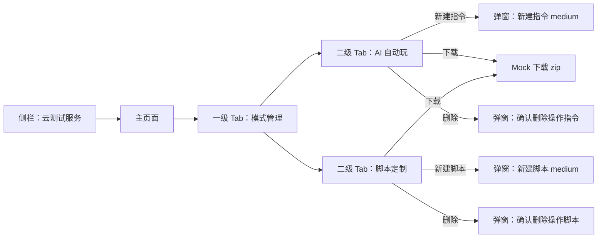

# prd_云测试服务_02b.md

## 最简单信息摘要（极简版）

- **需求目标**：在云测试服务主页面「模式管理」Tab 下，补齐 AI 指令与定制脚本的新建、下载、删除能力，帮助开发者维护测试模式资源。
- **页面数**：**1 页**（仅迭代 `webpage/云测试服务.html` 内「模式管理」Tab；**测试管理 Tab、测试报告二级页本期不改**）。
- **核心入口与跳转**：侧栏「开发 > 云测试服务」→ 一级 Tab「模式管理」→ 二级 Tab「AI 自动玩 / 脚本定制」；所有交互在弹窗内完成，无新增页面跳转。
- **模版组合**：`LayoutSpec` + `InfoQuery`（模式管理列表区，一期结构延续）+ `Modal`（medium · 684px 新建/删除确认）。
- **数据策略**：全量 **mock**，无真实接口；筛选与表格数据前端联动；空态遵循 Semi UI `Empty` 规范。
- **待确认项**：无阻塞项。

---

## 0. 一句话描述

在云测试服务主页面模式管理 Tab 下，补齐 AI 指令与定制脚本的新建、下载、删除能力，帮助开发者维护测试模式资源。

---

## 1. 信息架构

### 1.0 目录树对照

| # | 页面 | 判定 | 归属 group → leaf | 现有文件 |
|---|------|------|-------------------|----------|
| 1 | 云测试服务（主页面 · 模式管理 Tab） | **迭代** | Development → Cloud Testing Service | `webpage/云测试服务.html` |

- **不新增** group / leaf / 独立 HTML。
- **本期改动范围**：仅主页面内 **「模式管理」** 一级 Tab 及其下 **「AI 自动玩」「脚本定制」** 两个二级 Tab。
- **本期不改**：测试管理 Tab、测试报告二级页、对比弹窗后续能力等。

### 1.1 功能属性

| 项 | 内容 |
|----|------|
| 功能类型 | 既有 leaf 迭代（同页 Tab 能力补齐） |
| 迭代说明 | 在一期模式管理列表骨架上，补齐新建/下载/删除弹窗交互、筛选联动、表格数据 mock 闭环 |
| 目标用户 | 开发者 / 测试人员 |

### 1.2 导航与入口

| 项 | 内容 |
|----|------|
| 顶栏归属 | 沿用控制台壳层，顶栏不设选中态 |
| 侧栏路径 | **开发 > 云测试服务** |
| 默认选中项 | **云测试服务** |
| 功能入口 | 主页面一级 Tab → **模式管理** |

---

## 2. 页面数量与跳转关系

### 2.1 页面清单

| # | 页面名称 | 文件名/路由（建议） | 入口 | 跳转至 |
|---|----------|---------------------|------|--------|
| 1 | 云测试服务（主页面 · 模式管理） | `云测试服务.html` / `/console/development/cloud-testing` | 侧栏「开发 > 云测试服务」→ Tab「模式管理」 | 本期无跨页跳转；弹窗内完成交互 |

### 2.2 本期与分期边界

| 能力 | 本期（02b） | 说明 |
|------|-------------|------|
| 模式管理 · 新建指令/脚本 | ✅ | 含表单校验、表格新增 |
| 模式管理 · 下载 | ✅ | mock 触发占位 zip 下载 |
| 模式管理 · 删除 | ✅ | 二次确认 + 表格移除 |
| 模式管理 · 筛选联动 | ✅ | 名称 + 上传时间与表格 mock 数据关联 |
| 测试管理 Tab | ❌ 不改 | 维持 02a 已实现能力 |
| 测试报告二级页 | ❌ 不改 | — |
| 真实文件上传/存储 API | ❌ | 全站 mock |

### 2.3 跳转关系图



```text
侧栏「开发 > 云测试服务」
  → 云测试服务主页面
      └─ 模式管理（本期范围）
          ├─ AI 自动玩
          │     ├─ 新建指令 → Modal（medium）
          │     ├─ 下载 → 浏览器下载占位 zip
          │     └─ 删除 → 确认 Modal → 移除表格行
          └─ 脚本定制
                ├─ 新建脚本 → Modal（medium）
                ├─ 下载 → 浏览器下载占位 zip
                └─ 删除 → 确认 Modal → 移除表格行
```

---

## 3. 页面模版选型

| 页面/能力 | 主模版 | 变体 | 组合模版 | 选型依据 |
|-----------|--------|------|----------|----------|
| 模式管理列表区 | `InfoQuery.md` | 一级 Tab + 二级 Tab 列表 | `LayoutSpec.md` | 与一期模式管理结构一致：筛选 + 表格 + 操作列 + 分页 |
| 新建指令 / 新建脚本 | `Modal.md` | **medium（684px）** · 输入类（名称 + 文件上传） | — | 字段较少，与新建测试弹窗尺寸体系对齐 |
| 删除确认（指令/脚本） | `Modal.md` | **medium（684px）** · 确认提示 | — | 统一弹窗尺寸规范 |

---

## 4. 页面内元素

### 4.1 页面：云测试服务（主页面 · 模式管理 Tab 迭代）

> **测试管理 Tab**、页头、Banner、壳层等 **维持 02a 不变**。本节仅描述模式管理本期补齐内容。

#### 4.1.1 一级 Tab：模式管理 · 公共结构

| 模块 | 元素 | 类型 | 说明 |
|------|------|------|------|
| 一级 Tab | 模式管理 | Line Tab | 与「测试管理」并列；进入后展示二级 Tab |
| 二级 Tab | AI 自动玩 / 脚本定制 | Button Tab | 样式与一期一致（按钮式二级 Tab） |
| 列表区 | 筛选 + 表格 + 分页 | InfoQuery | 两个二级 Tab 各一套独立数据与筛选状态 |

**Tab 切换规则**：切换二级 Tab 时，各自保留筛选条件与表格数据；互不影响。

---

#### 4.1.2 二级 Tab：AI 自动玩

##### 筛选区

| 模块 | 元素/字段 | 类型 | 必填 | 说明 |
|------|-----------|------|------|------|
| 筛选区 | 指令名称 | 搜索输入 | 否 | 关键字检索；**与当前 Tab 表格 mock 数据联动过滤** |
| 筛选区 | 上传时间 | 日期区间 | 否 | 精确到日期；**与表格「上传时间」字段联动过滤** |
| 筛选区 | 新建指令 | 主按钮 | — | 打开「新建指令」弹窗 |

##### 表格区

| 模块 | 元素/字段 | 类型 | 必填 | 说明 |
|------|-----------|------|------|------|
| 表格区 | 指令名称 | 文本 | 是 | 列表主字段；mock 为英文字符名称 |
| 表格区 | 上传用户 | 文本 | 是 | mock 用户名 |
| 表格区 | 上传时间 | 时间 | 是 | 精确到分钟 |
| 表格区 | 操作 | 下载 / 删除 | 是 | **下载**为蓝色链接；**删除**为红色链接（`.danger`） |
| 表格区 | 分页 | Pagination | — | 与测试管理表格一致：总数、翻页、每页条数可调 |

##### 弹窗：新建指令（medium · 684px）

| 模块 | 元素/字段 | 类型 | 必填 | 说明 |
|------|-----------|------|------|------|
| 标题 | 新建指令 | 文本 | — | — |
| 表单 | 指令名称 | Input | **是** | 最长 **30** 个字符；超长不可提交并提示 |
| 表单 | 指令文件 | Upload | **是** | 备注文案：**上传指令格式为 zip，大小不超过 55M** |
| 底栏 | 取消 | 按钮 | — | 关闭弹窗，不保存 |
| 底栏 | 确定 | 主按钮 | — | 校验通过后提交（见 §5） |
| 交互 | 右上角关闭 | Icon | — | 同取消 |

**上传校验（前端 mock）**

| 规则 | 说明 |
|------|------|
| 文件格式 | 仅接受 `.zip` |
| 文件大小 | ≤ 55MB，超出提示错误 |
| 未选文件 | 不可提交 |

##### 弹窗：确认删除操作指令（medium · 684px）

| 模块 | 元素/字段 | 类型 | 说明 |
|------|-----------|------|------|
| 标题 | 确认删除操作指令 | 文本 | — |
| 内容 | 删除后操作指令不再生效 | 文本 | 固定文案 |
| 底栏 | 取消 | 次按钮 | 关闭弹窗，不删除 |
| 底栏 | 删除 | 危险主按钮 | 确认后从表格移除该行（见 §5） |
| 交互 | 右上角关闭 | Icon | 同取消 |

---

#### 4.1.3 二级 Tab：脚本定制

##### 筛选区

| 模块 | 元素/字段 | 类型 | 必填 | 说明 |
|------|-----------|------|------|------|
| 筛选区 | 脚本名称 | 搜索输入 | 否 | 关键字检索；**与当前 Tab 表格 mock 数据联动过滤** |
| 筛选区 | 上传时间 | 日期区间 | 否 | 精确到日期；**与表格联动过滤** |
| 筛选区 | **新建脚本** | 主按钮 | — | 文案为 **「新建脚本」**（与 AI Tab「新建指令」区分） |

##### 表格区

| 模块 | 元素/字段 | 类型 | 必填 | 说明 |
|------|-----------|------|------|------|
| 表格区 | 脚本名称 | 文本 | 是 | 列表主字段 |
| 表格区 | 上传用户 | 文本 | 是 | mock 用户名 |
| 表格区 | 上传时间 | 时间 | 是 | 精确到分钟 |
| 表格区 | 操作 | 下载 / 删除 | 是 | 下载蓝色；删除红色 |
| 表格区 | 分页 | Pagination | — | 同 AI Tab |

##### 弹窗：新建脚本（medium · 684px）

| 模块 | 元素/字段 | 类型 | 必填 | 说明 |
|------|-----------|------|------|------|
| 标题 | 新建脚本 | 文本 | — | — |
| 表单 | 脚本名称 | Input | **是** | 最长 **30** 个字符 |
| 表单 | 脚本文件 | Upload | **是** | 备注：**上传指令格式为 zip，大小不超过 55M**（沿用原文案） |
| 底栏 | 取消 / 确定 | 按钮 | — | 规则同「新建指令」 |

##### 弹窗：确认删除操作脚本（medium · 684px）

| 模块 | 元素/字段 | 类型 | 说明 |
|------|-----------|------|------|
| 标题 | 确认删除操作脚本 | 文本 | — |
| 内容 | 删除后脚本不再生效 | 文本 | 固定文案 |
| 底栏 | 取消 / 删除 | 按钮 | 规则同删除指令弹窗 |

---

## 5. 关键交互与状态（本期）

| 场景 | 规则 |
|------|------|
| 数据 | 全量 **mock**；无真实接口；AI 与脚本两套独立数据集 |
| 新建确定 | 名称 + 文件校验通过 → Toast 成功 → 关闭弹窗 → **表格新增一行**（名称=表单值；上传用户=当前用户 mock，如 `Sally07`；上传时间=当前时间，精确到分钟） |
| 名称校验 | 必填；trim 后非空；长度 ≤ 30 字符 |
| 文件校验 | 必填；zip；≤ 55MB |
| 下载 | 点击「下载」→ 触发浏览器下载 **占位 zip**（文件名可与行名称关联，如 `{名称}.zip`） |
| 删除 | 点击红色「删除」→ 打开确认弹窗 → 点「删除」→ **从表格移除该行** + Toast 成功 |
| 筛选 | **指令/脚本名称**模糊匹配；**上传时间**按日期区间过滤；过滤后分页基于筛选结果 |
| 空状态 | 筛选无结果或表格无数据时，使用 Semi UI **`Empty`** 组件展示空态（含合理 description） |
| 加载/错误 | 本期无真实请求；错误态仅用于表单校验失败提示（Semi Form / Toast） |
| 弹窗关闭 | 右上角关闭 + 底栏取消，均不保存 |

**与测试管理联动（下游消费，本期需保证数据源可用）**

- 测试管理「新建测试」弹窗中，选择「AI 自动玩」时「测试指令」下拉选项来源为本 Tab 表格数据；选择「脚本定制」时来源为脚本 Tab 表格数据（02a 已定义展示格式，02b 补齐后可被正确读取）。

---

## 6. 待确认项

- 本期无阻塞待确认项。

---

## 7. 交付物（确认后生成）

| 交付物 | 路径 |
|--------|------|
| 主页面迭代（模式管理 Tab） | `webpage/云测试服务.html` |
